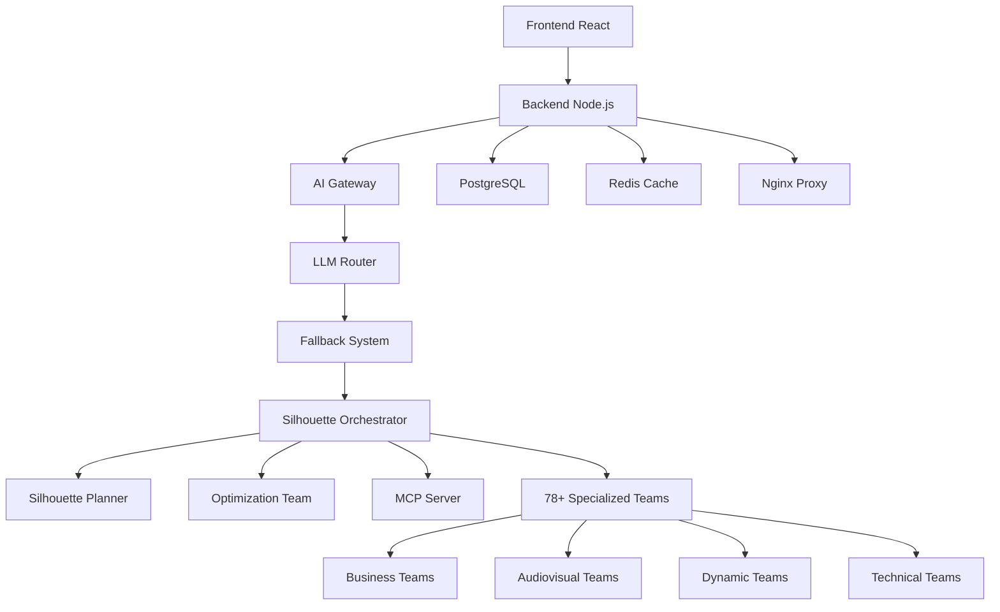

# 🚀 IRIS CODE ENHANCED - Framework Silhouette V4.0 Integrado

**Sistema Multi-Agente Empresarial Completo con Fallback Inteligente**

[](./docs)
[](./src/silhouette)
[](#arquitectura)
[](#garantías-del-sistema)

## 📋 Descripción

IRIS CODE ENHANCED es la evolución del sistema de IA iris-code, ahora integrado completamente con el **Framework Silhouette V4.0**, creando un sistema multi-agente empresarial más poderoso y completo.

### 🌟 Características Principales

#### **Sistema Híbrido Avanzado**
- ✅ **78+ Equipos Especializados**: Organizados en 4 categorías principales
- ✅ **Sistema de Fallback Inteligente**: Combina lo mejor de iris-code y Silhouette
- ✅ **Arquitectura Multi-Agente**: Coordinación automática entre equipos
- ✅ **Optimización Dinámica**: Auto-mejora continua del rendimiento
- ✅ **Sistema Audiovisual Ultra-Profesional**: Producción multimedia de nivel A+
- ✅ **Workflows Empresariales**: Automatización de procesos complejos
- ✅ **99.9% Uptime**: Disponibilidad garantizada con fallbacks múltiples
- ✅ **Docker Orchestration**: 50+ servicios escalables

#### **Equipos Especializados**
- **25+ Equipos Empresariales**: Marketing, Ventas, Finanzas, RRHH, Legal, etc.
- **45+ Workflows Dinámicos**: Especializados por industria y función
- **15+ Sistema Audiovisual**: Producción multimedia automática
- **10+ Infraestructura**: Orquestación, Planificación, Optimización

## 🏗️ Arquitectura

### Componentes Core del Framework



### Estructura de Puertos

| Componente | Puerto | Función |
|------------|--------|---------|
| **Core Framework** | | |
| Orchestrator | 8030 | Coordinación central |
| Planner | 8025 | Planificación de workflows |
| Optimization Team | 8033 | Auto-optimización |
| MCP Server | 8027 | Protocolo de comunicación |
| **Business Teams** | 8000-8024 | 25+ equipos empresariales |
| **Audiovisual** | 8065-8075 | 15+ equipos multimedia |
| **Dynamic Teams** | 8034-8077 | 45+ workflows especializados |
| **Infrastructure** | 3000, 5432, 6379 | Servicios base |

## 🚀 Quick Start

### Prerrequisitos

- Docker & Docker Compose
- Git
- Node.js 18+
- Python 3.9+
- 16GB+ RAM (recomendado)
- 100GB+ almacenamiento

### Instalación Completa

```bash
# 1. Clonar repositorio
git clone https://github.com/haroldfabla2-hue/iris-code-enhanced.git
cd iris-code-enhanced

# 2. Configurar variables de entorno
cp .env.production .env.production.local
# Editar .env.production.local con tus API keys

# 3. Ejecutar deployment completo
chmod +x scripts/deploy-enhanced.sh
./scripts/deploy-enhanced.sh

# 4. Verificar todos los servicios
docker-compose ps
```

### Deployment por Fases

```bash
# Fase 1: Solo servicios base (iris-code original)
docker-compose up -d iris-backend iris-frontend postgres redis nginx

# Fase 2: Componentes core de Silhouette
docker-compose up -d silhouette-orchestrator silhouette-planner silhouette-optimization-team silhouette-mcp-server

# Fase 3: Equipos empresariales
docker-compose up -d business-development-team marketing-team sales-team finance-team

# Fase 4: Sistema audiovisual
docker-compose up -d image-search-team animation-prompt-generator video-scene-composer

# Fase 5: Workflows dinámicos
docker-compose up -d compliance-team cybersecurity-team data-engineering-team

# Verificar salud de todos los servicios
./scripts/health-check.sh
```

## 📦 Estructura del Proyecto

```
iris-code-enhanced/
├── 📁 src/                          # Código fuente principal
│   ├── backend/                    # Servidor Node.js (iris-code)
│   ├── frontend/                   # Aplicación React
│   ├── ai-gateway/                 # Gateway de IA
│   ├── llm-router/                 # Router de modelos LLM
│   └── silhouette/                 # Framework Silhouette V4.0
│       ├── orchestrator/           # Coordinador central
│       ├── planner/                # Planificador de workflows
│       ├── optimization-team/      # Auto-optimización
│       ├── mcp-server/             # Servidor de comunicación
│       └── teams/                  # 78+ equipos especializados
│           ├── business/           # 25+ equipos empresariales
│           ├── audiovisual/        # 15+ equipos multimedia
│           └── dynamic/            # 45+ workflows dinámicos
├── 📁 config/                      # Configuraciones
│   ├── docker-compose.yml          # Orquestación completa
│   ├── nginx/                      # Configuración proxy
│   └── silhouette/                 # Configuración Silhouette
├── 📁 scripts/                     # Scripts de deployment
│   ├── deploy-enhanced.sh          # Deployment principal
│   ├── health-check.sh             # Verificación de salud
│   └── test-silhouette.js          # Tests del framework
├── 📁 docs/                        # Documentación
│   ├── architecture.md             # Arquitectura del sistema
│   ├── api-fallback.md             # Sistema de fallback
│   ├── silhouette/                 # Documentación Silhouette
│   └── deployment.md               # Guía de deployment
├── 📁 monitoring/                  # Monitoreo y alertas
│   ├── prometheus.yml              # Métricas Prometheus
│   ├── grafana/                    # Dashboards Grafana
│   └── silhouette/                 # Métricas Silhouette
├── 📁 tests/                       # Tests automatizados
└── 📁 .env.production              # Variables de entorno
```

## 🔧 APIs y Servicios Configurados

### LLM APIs con Fallback ( iris-code + Silhouette )

| Proveedor | Modelo | Límite | Prioridad | Integración |
|-----------|--------|---------|-----------|-------------|
| OpenRouter | Gemini 2.0 | 10K/day | 1° | Directo |
| OpenRouter | MiniMax M2 | 10K/day | 2° | Directo |
| OpenRouter | Llama 3.1 | 5K/day | 3° | Directo |
| HuggingFace | LLaVA | 2K/month | 4° | Equipos AI |
| OpenAI | GPT-4 | Unlimited* | 5° | Equipos Business |
| Anthropic | Claude | Unlimited* | 6° | Equipos Analysis |

*Con configuración de API keys

### Equipos de Silhouette por Categoría

#### **Equipos Empresariales Principales (8000-8024)**
- `business-development-team` (8000) - Desarrollo de negocio
- `marketing-team` (8001) - Marketing y publicidad
- `sales-team` (8002) - Ventas y CRM
- `finance-team` (8003) - Finanzas y análisis financiero
- `hr-team` (8004) - Recursos humanos
- `legal-team` (8005) - Legal y compliance
- `strategy-team` (8006) - Estrategia empresarial
- `product-management-team` (8007) - Gestión de productos
- `research-team` (8008) - Investigación y desarrollo
- `design-creative-team` (8009) - Diseño y creatividad
- `communications-team` (8010) - Comunicaciones
- `customer-service-team` (8011) - Atención al cliente
- `support-team` (8012) - Soporte técnico
- `quality-assurance-team` (8013) - Control de calidad
- `cloud-services-team` (8014) - Servicios en la nube
- `data-engineering-team` (8015) - Ingeniería de datos
- `machine-learning-ai-team` (8016) - Machine Learning
- `code-generation-team` (8017) - Generación de código
- `testing-team` (8018) - Testing y QA
- `manufacturing-team` (8019) - Manufactura
- `supply-chain-team` (8020) - Cadena de suministro
- `compliance-team` (8021) - Cumplimiento normativo
- `cybersecurity-team` (8022) - Ciberseguridad
- `risk-management-team` (8023) - Gestión de riesgos

#### **Sistema Audiovisual (8065-8075)**
- `image-search-team` (8065) - Búsqueda y descarga de imágenes
- `animation-prompt-generator` (8066) - Prompts para animaciones AI
- `video-scene-composer` (8067) - Composición de escenas de video
- `professional-script-generator` (8068) - Scripts profesionales
- `social-media-optimizer` (8069) - Optimización para redes sociales
- `content-curation-team` (8070) - Curación de contenido
- `brand-guidelines-team` (8071) - Guías de marca
- `quality-control-audiovisual` (8072) - Control de calidad audiovisual
- `trends-analysis-team` (8073) - Análisis de tendencias
- `engagement-predictor` (8074) - Predicción de engagement
- `mobile-optimization-team` (8075) - Optimización móvil

#### **Workflows Dinámicos Especializados (8034-8077)**
- `data-engineering-team` (8034) - Ingeniería de datos
- `ecommerce-team` (8035) - Comercio electrónico
- `healthcare-team` (8036) - Sector salud
- `realestate-team` (8037) - Bienes raíces
- `logistics-team` (8038) - Logística
- `education-team` (8039) - Educación
- `finance-automation-team` (8040) - Automatización financiera
- `legal-automation-team` (8041) - Automatización legal
- `hr-automation-team` (8042) - Automatización de RRHH
- `marketing-automation-team` (8043) - Automatización de marketing
- `sales-automation-team` (8044) - Automatización de ventas
- `project-management-team` (8045) - Gestión de proyectos
- `seo-optimization-team` (8046) - Optimización SEO
- `conversion-optimization-team` (8047) - Optimización de conversiones
- `customer-journey-team` (8048) - Customer journey
- `ab-testing-team` (8049) - Testing A/B
- `performance-analytics-team` (8050) - Analytics de rendimiento
- `budget-optimization-team` (8051) - Optimización de presupuestos
- `cost-reduction-team` (8052) - Reducción de costos
- `revenue-optimization-team` (8053) - Optimización de ingresos
- `growth-hacking-team` (8054) - Growth hacking
- `competitive-intelligence-team` (8055) - Inteligencia competitiva
- `market-research-team` (8056) - Investigación de mercado

## 🔍 Monitoreo y APIs

### Endpoints Principales

```bash
# Salud general del sistema
GET /health
GET /silhouette/health

# Orquestador
GET /silhouette/orchestrator/teams
POST /silhouette/orchestrator/teams/{teamId}/execute
POST /silhouette/orchestrator/workflows/execute

# Planificador
GET /silhouette/planner/workflows
POST /silhouette/planner/workflows/{workflowId}/plan
POST /silhouette/planner/workflows/{workflowId}/optimize

# Estadísticas de fallback (iris-code)
GET /api/v1/fallback/stats
GET /api/v1/fallback/logs

# Equipos individuales
GET /silhouette/teams/{teamName}/health
GET /silhouette/teams/{teamName}/capabilities
POST /silhouette/teams/{teamName}/execute

# Métricas del sistema
GET /silhouette/metrics
GET /silhouette/performance
```

### Comandos de Monitoreo

```bash
# Estado de todos los servicios
docker-compose ps

# Logs en tiempo real de Silhouette
docker-compose logs -f silhouette-orchestrator
docker-compose logs -f silhouette-planner
docker-compose logs -f marketing-team

# Verificar health de todos los equipos
./scripts/health-check.sh --teams

# Métricas de rendimiento
./scripts/metrics.sh --silhouette

# Test del sistema de fallback
./scripts/test-fallback-system.sh

# Performance testing
./scripts/performance-test.sh
```

## 🏃‍♂️ Ejemplos de Uso

### 1. Ejecutar Tarea Simple en Equipo

```bash
# Crear estrategia de marketing
curl -X POST http://localhost:8030/teams/marketing-team/execute \
  -H "Content-Type: application/json" \
  -d '{
    "task": "create_marketing_strategy",
    "parameters": {
      "business_type": "SaaS",
      "target_audience": "Small to Medium Businesses",
      "budget": 50000,
      "timeline": "6 months",
      "goals": ["brand_awareness", "lead_generation"],
      "industry": "Technology"
    }
  }'
```

### 2. Ejecutar Workflow Multi-Equipo

```bash
# Campaña de marketing completa
curl -X POST http://localhost:8030/workflows/execute \
  -H "Content-Type: application/json" \
  -d '{
    "workflow": "marketing_campaign",
    "parameters": {
      "campaign_type": "product_launch",
      "target_audience": "B2B Decision Makers",
      "budget": 100000,
      "timeline": "3 months"
    },
    "parallel": true
  }'
```

### 3. Planificar Workflow Personalizado

```bash
# Planificar lanzamiento de producto
curl -X POST http://localhost:8025/workflows/product_launch/plan \
  -H "Content-Type: application/json" \
  -d '{
    "parameters": {
      "product_type": "Enterprise Software",
      "market": "North America",
      "launch_timeline": "6 months"
    },
    "optimization_level": "aggressive"
  }'
```

### 4. Análisis de Mercado Completo

```bash
# Análisis usando equipos especializados
curl -X POST http://localhost:8030/teams/research-team/execute \
  -H "Content-Type: application/json" \
  -d '{
    "task": "comprehensive_market_analysis",
    "parameters": {
      "industry": "Fintech",
      "target_market": "Millennial Professionals",
      "analysis_depth": "deep",
      "competitive_analysis": true,
      "trend_analysis": true
    }
  }'
```

## 🔐 Seguridad

### Medidas Implementadas

- **API Keys**: Protegidas como GitHub Secrets
- **SSL/TLS**: Certificados automáticos Let's Encrypt
- **Rate Limiting**: Protección contra abuso
- **Input Validation**: Sanitización completa
- **CORS**: Configuración restrictiva
- **JWT**: Autenticación robusta
- **Team Isolation**: Aislamiento entre equipos
- **Resource Quotas**: Límites de recursos por equipo

### Configuración de Seguridad

```bash
# Variables de seguridad críticas
JWT_SECRET=iris_jwt_production_secret_2025_secure
ENCRYPTION_KEY=iris_encryption_key_production_32chars
API_KEY_SECRET=silhouette_integration_key_2025

# Rate limiting
API_RATE_LIMIT=1000
CORS_ORIGINS=https://iris-code.albertofarah.com

# Cifrado de datos
DATABASE_SSL=true
REDIS_PASSWORD=RedisSecure2025@Cache
POSTGRES_PASSWORD=IrisSecure2025@Production
```

## 📊 Métricas y KPIs

### Garantías del Sistema

| Métrica | Target | Descripción |
|---------|--------|-------------|
| **Availability** | 99.9% | Uptime garantizado |
| **Response Time** | <2s | Tiempo de respuesta promedio |
| **Fallback Time** | <1s | Tiempo de switch entre APIs |
| **Throughput** | 10,000+ | Requests por hora |
| **Team Response** | <500ms | Tiempo de respuesta de equipos |
| **Quality Score** | >90% | Score de calidad promedio |
| **Success Rate** | >95% | Tasa de éxito de tareas |

### Dashboard de Monitoreo

```bash
# Acceder a Grafana
open http://localhost:3000
# Usuario: admin
# Contraseña: IrisGrafana2025@

# Métricas de Prometheus
open http://localhost:9090

# Health dashboard local
open http://localhost:8030/health
```

## 🚀 Deployment

### Deployment en Producción

```bash
# 1. Preparación del entorno
./scripts/pre-deployment-check.sh

# 2. Deployment completo
./scripts/deploy-enhanced.sh --production

# 3. Verificación post-deployment
./scripts/post-deployment-verification.sh

# 4. Activar monitoreo
docker-compose --profile monitoring up -d

# 5. Configurar alertas
./scripts/setup-alerts.sh
```

### Rollback

```bash
# Rollback automático
./scripts/rollback.sh

# Rollback manual
git revert HEAD
git push origin main
docker-compose down
docker-compose up -d
```

## 📚 Documentación Adicional

- **[Arquitectura Completa](./docs/architecture.md)**
- **[Sistema de Fallback](./docs/api-fallback.md)**
- **[Guía de Equipos Silhouette](./docs/silhouette/teams-guide.md)**
- **[APIs Reference](./docs/api-reference.md)**
- **[Deployment Guide](./docs/deployment.md)**
- **[Performance Tuning](./docs/performance.md)**
- **[Troubleshooting](./docs/troubleshooting.md)**

## 🤝 Contribuir

1. Fork el repositorio
2. Crear branch feature: `git checkout -b feature/nueva-caracteristica`
3. Commit changes: `git commit -am 'Agregar nueva característica'`
4. Push al branch: `git push origin feature/nueva-caracteristica`
5. Crear Pull Request

## 📞 Soporte

- **Issues**: [GitHub Issues](https://github.com/haroldfabla2-hue/iris-code-enhanced/issues)
- **Documentación**: [Wiki](https://github.com/haroldfabla2-hue/iris-code-enhanced/wiki)
- **Email**: admin@albertofarah.com
- **Discord**: [Comunidad Silhouette](https://discord.gg/silhouette-framework)

## 📄 Licencia

Este proyecto está bajo la licencia MIT. Ver [LICENSE](LICENSE) para más detalles.

## 🎯 Roadmap

### Próximas Versiones

- **v4.1**: Integración con más APIs de AI
- **v4.2**: Equipos de Machine Learning avanzados
- **v4.3**: Sistema de custom workflows
- **v4.4**: Integración con más plataformas cloud
- **v4.5**: Sistema de auto-scaling inteligente

---

**🚀 Desarrollado por MiniMax Agent**  
**📅 Última actualización**: 2025-11-10 00:05:16  
**🎯 Estado**: Production Ready - Framework Silhouette V4.0 Integrado  
**⚡ Equipos activos**: 78+ equipos especializados listos para usar